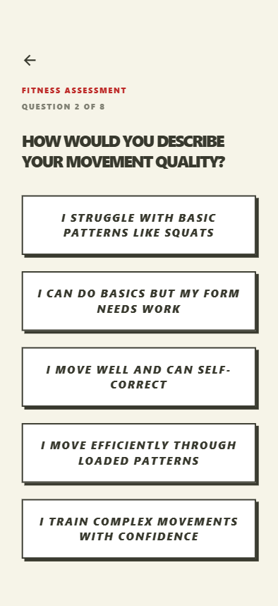
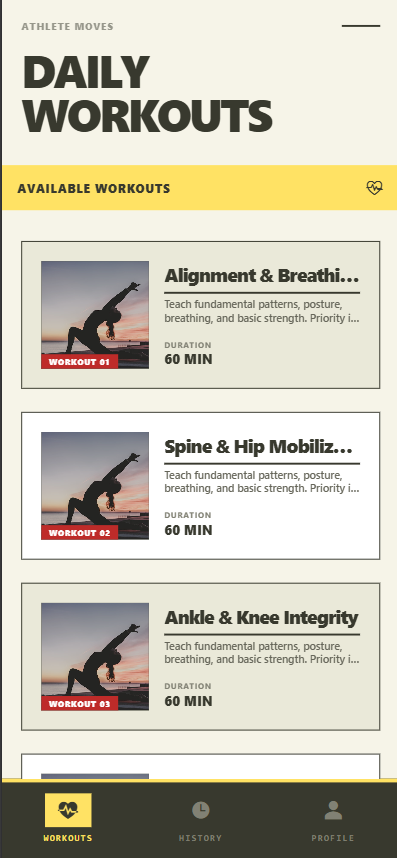
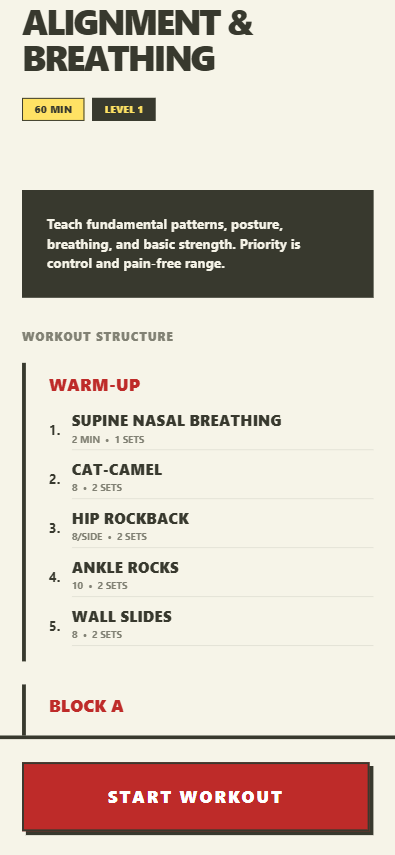
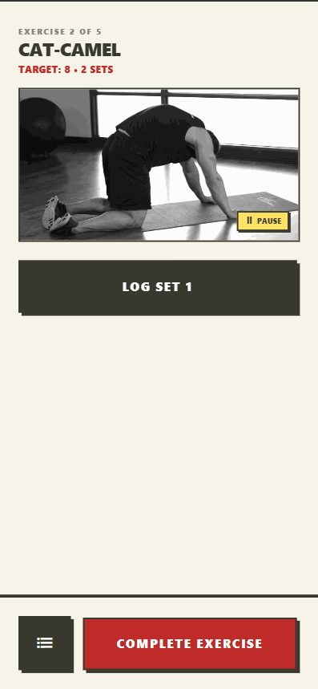
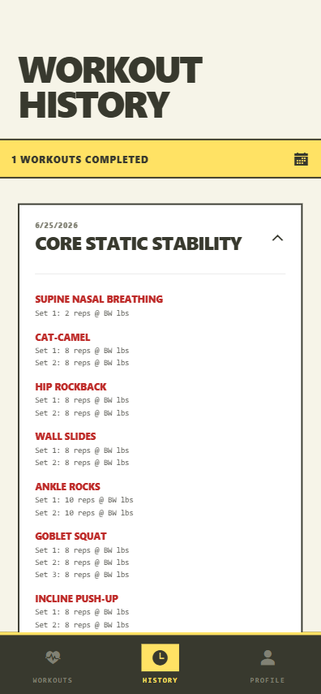

# Athlete Moves

**A cross-platform workout app for athlete assessment, workout tracking, and history-based progression.**

I built Athlete Moves independently using **React Native, Expo, Supabase, and PostgreSQL**. It runs on iOS, Android, and web.

The app takes an athlete through the full training flow:

**Assessment → Workout Discovery → Active Workout → History → Progression**

> **Source code is private.** This repository showcases the product, technologies, and engineering work without exposing private implementation details or progression logic.

---

## What It Does

Athlete Moves allows users to:

- Create an account and complete an initial fitness assessment
- Receive an athlete level based on the assessment
- Browse workouts matched to their current level
- View workout phases, exercises, instructions, and targets
- Track reps, weight, sets, and timed exercises during a workout
- Pause, resume, and adjust active workout timers
- Save completed workouts and exercise results
- Review previous workouts through workout history
- Receive optional weight recommendations based on recent performance
- Track progression and advance to the next training level when eligible

Weight recommendations are suggestions only. The athlete chooses whether to use them and can still edit the weight manually.

---

## App Walkthrough

### Athlete Assessment

New users complete a fitness assessment that helps determine their initial athlete level.

  

### Workout Discovery

Athletes can browse workouts matched to their current training level and preview the exercises before starting.

  
  &nbsp;&nbsp;
  

### Active Workout

During a workout, users move through exercises and record their actual performance.

  

### Workout History

Completed sessions and exercise-level results are saved so athletes can review previous performance.

  

---

## Tech Stack

**Frontend:** React Native, Expo, Expo Router  
**Languages:** JavaScript / JSX, some TypeScript  
**Backend:** Supabase  
**Database:** PostgreSQL  
**Authentication:** Supabase Auth  
**Data Fetching:** TanStack React Query  
**Styling:** NativeWind / Tailwind CSS  
**Local Storage:** AsyncStorage / localStorage  
**Builds:** Expo EAS

---

## What I Built

I developed Athlete Moves independently, including:

- Cross-platform mobile UI
- Account creation and authentication
- Athlete assessment and level assignment
- Workout discovery and workout detail screens
- Active workout tracking
- Set, rep, weight, and timer logic
- Pause/resume behavior
- Workout history and exercise-result storage
- History-based weight recommendations
- Athlete level-progression logic
- Supabase integration
- Responsive UI and navigation

---

## Progression System

Athlete Moves uses recent workout history to support future training decisions.

For supported weighted exercises, the app can suggest an updated weight based on recent performance. The athlete decides whether to apply the recommendation and can edit the value manually.

The app also evaluates workout history to determine when an athlete is eligible to advance to the next training level.

The recommendation system uses **deterministic application logic**, not a generative-AI model.

The exact progression rules are intentionally kept private.

---

## Project Status

Athlete Moves is currently a **functional development prototype**.

The main application workflow is working, including authentication, assessment, workout discovery, active workout tracking, saved history, recommendations, and level progression.

The project is still under active development and is not currently presented as a public production release.

---

## Source Code

The production source repository remains private because Athlete Moves is an active personal project.

This showcase intentionally does not expose:

- Application source code
- Supabase credentials
- Database structure
- Private athlete data
- Progression thresholds
- Recommendation algorithms
- Environment variables or production configuration

This repository exists to demonstrate the product and the engineering behind it without publishing proprietary implementation details.

---

## About Me

**Greyson Denison-Fischer**  
Computer Science student at Central Michigan University  
Graduating May 2027

[LinkedIn](https://www.linkedin.com/in/greyson-fischer/) · [GitHub](https://github.com/dgreyson3)
