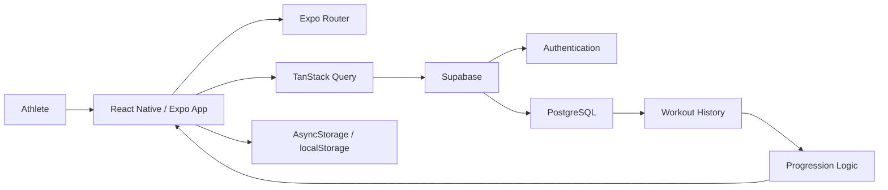

# Athlete Moves

**A cross-platform workout application connecting athlete assessment, interactive training, workout history, and history-informed progression.**

**Status:** Functional development prototype · 2026  
**Platforms:** iOS/iPadOS · Android · Web

> **Source availability:** This repository is a public project showcase.  
> The working application's source code, private implementation details, database structure, and proprietary progression logic remain private.

---

## Overview

Athlete Moves is a cross-platform fitness application I independently designed and built using **React Native, Expo, and Supabase**.

The app guides an athlete through a complete training workflow:

**Assessment → Athlete Level → Workout Discovery → Interactive Training → Workout History → Progression**

Users begin with a fitness assessment that establishes an initial training level. From there, they can browse workouts matched to their level, inspect workout details, complete sessions interactively, record performance, review previous workouts, and track progression over time.

The application also uses recent exercise history to provide **optional weight recommendations**. Athletes remain in control of their training data and can choose whether to apply a recommendation or manually enter their own weight.

---

## Product Walkthrough

### 1. Athlete Assessment

New users complete a fitness questionnaire that contributes to their initial athlete level and determines the workouts available to them.

  

---

### 2. Level-Matched Workout Discovery

Athletes can browse workouts available for their current training level.

Each workout provides a structured training session containing phases, exercises, targets, instructions, and available exercise media.

  
  &nbsp;&nbsp;&nbsp;
  

---

### 3. Interactive Workout Tracking

During an active workout, athletes move through exercises and record their actual performance.

The workout interface supports:

- Set tracking
- Repetition logging
- Weight logging
- Timed exercises
- Adjustable workout timers
- Pause and resume behavior
- Removing incorrectly logged sets
- Navigation between exercises and workout phases

  

---

### 4. Persistent Workout History

Completed workouts and exercise-level results are stored in the athlete's workout history.

Athletes can return to previous sessions, expand workout entries, review their recorded performance, and delete saved history when needed.

  

---

## History-Informed Progression

Athlete Moves uses previously recorded workout performance to support future training decisions.

For supported weighted exercises, the application can evaluate recent performance for the same exercise and present an **optional weight recommendation**.

The athlete chooses whether to apply the recommendation and can still edit the weight manually.

Rep targets are defined by the selected workout, while athletes record the repetitions they actually complete.

The application also analyzes recent workout history to determine whether an athlete is eligible to advance to the next training level. Advancement remains a **user-initiated action** rather than an automatic change to the athlete's program.

The recommendation and progression systems use deterministic application logic rather than a runtime generative-AI model.

> Exact progression rules and recommendation logic are intentionally not included in this public showcase.

---

## Current Features

### Accounts and Athlete Profiles

- Account creation and authentication
- Sign in and sign out
- Initial fitness assessment
- Athlete-level assignment
- Persistent user sessions

### Workout Discovery

- Level-matched workout browsing
- Workout detail views
- Structured workout phases
- Exercise targets and instructions
- Exercise media support

### Active Workouts

- Interactive exercise navigation
- Set tracking
- Repetition and weight logging
- Timed exercise support
- Adjustable timers
- Pause/resume behavior
- Set deletion and correction

### Workout History

- Persistent completed-workout storage
- Exercise-level performance records
- Expandable workout-history entries
- History deletion

### Progression

- Recent-performance analysis
- Optional history-informed weight recommendations
- Athlete progression-status tracking
- Eligibility checks for advancement
- User-controlled movement to the next training level

---

## My Contribution

I built Athlete Moves independently and implemented the application end-to-end.

## Technology Stack

| Area | Technologies |
| --- | --- |
| **Primary Language** | JavaScript / JSX |
| **Additional Project Code** | TypeScript |
| **Application Framework** | React 19, React Native 0.81 |
| **Platform / Tooling** | Expo 54 |
| **Navigation** | Expo Router |
| **Backend** | Supabase |
| **Database** | PostgreSQL through Supabase |
| **Authentication** | Supabase Auth |
| **Data Fetching / State** | TanStack React Query |
| **Styling** | NativeWind / Tailwind CSS |
| **Local Persistence** | AsyncStorage, browser localStorage |
| **UI / Interaction** | Expo Image, Expo Haptics, React Native Reanimated, React Native Animatable |
| **Mobile Builds** | Expo Application Services (EAS) |

---

## Technical Design

At a high level, Athlete Moves separates the mobile interface, application state, local persistence, and cloud-backed user data.

### Application Layer

React Native and Expo provide the shared application foundation across native mobile and web targets.

Expo Router manages navigation between assessment, workout discovery, active training, history, and profile-related screens.

### Data Layer

Supabase provides authentication and PostgreSQL-backed application data.

TanStack Query manages application data fetching and synchronization between the client and backend.

### Local Persistence

Native sessions use AsyncStorage, while the web target uses browser local storage where appropriate.

### Progression Layer

Workout-history data supports progression checks and optional exercise recommendations.

---

## Engineering Decisions

### Cross-Platform Development

React Native and Expo allow the same application architecture to target iOS, Android, and web while still supporting platform-specific behavior where necessary.

### Persistent Performance History

Workout results are stored beyond the lifetime of an individual session so the application can provide athletes with meaningful historical context rather than functioning only as a temporary workout checklist.

### Athlete-Controlled Recommendations

Recommendations are intentionally presented as suggestions rather than silently modifying workout data.

The athlete retains control over the final values recorded during a session.

### Level-Based Training

Athlete levels provide a structured way to match users with appropriate workouts while keeping progression separate from individual workout completion.

---

## Development Status

Athlete Moves is currently a **functional development prototype**.

The application supports the complete workflow demonstrated in this repository, including authentication, athlete assessment, workout discovery, active workout tracking, workout history, progression evaluation, and optional weight recommendations.

The project is not currently presented as a publicly released production application.

Additional production-hardening work and automated testing remain areas for continued development.

---

## What This Repository Contains

This public repository contains:

- Project documentation
- Product screenshots
- High-level architecture information
- Technology and engineering explanations

It intentionally does **not** contain:

- Application source code
- Supabase credentials
- Database schemas
- Authentication configuration
- Private athlete information
- Proprietary recommendation rules
- Progression thresholds
- Production secrets or environment variables

The working application is maintained separately in a private repository.

---

## About the Project

Athlete Moves gave me the opportunity to work across the full application stack rather than focusing on a single isolated component.

The project required combining:

- Cross-platform mobile UI development
- Authentication
- Persistent application data
- Relational data storage
- Interactive application state
- Timers and session behavior
- Historical workout data
- Recommendation logic
- User progression
- Responsive design
- Mobile build tooling

It remains an actively evolving personal software project.

---

## Author

**Greyson Denison-Fischer**  
Computer Science · Central Michigan University · May 2027

[LinkedIn](https://www.linkedin.com/in/greyson-fischer/) · [GitHub](https://github.com/dgreyson3)
